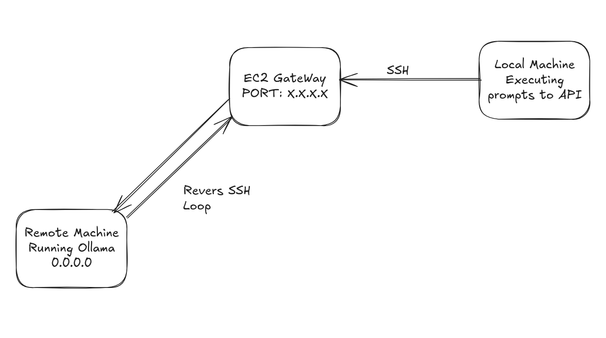

# Remote LLM Execution Gateway

This project allows you to offload the execution of LLM prompts to a **remote machine with an integrated GPU**, eliminating the need for GPU power or disk space on your local working machine. The key idea is to install any LLM model (via [Ollama](https://ollama.com/)) on a remote GPU-enabled host and tunnel access to it through a lightweight EC2 instance.

### 💡 Why?

- No need to run heavy models locally.
- No need for an expensive EC2 GPU instance running 24/7.
- Much cheaper than using managed LLM services or tools like Cursor.

**Trade-off:** Your GPU remote machine must stay online, but the cost is usually much lower than cloud alternatives.

---

## 🏗️ Architecture



---

## ⚙️ Hardware Requirements

- **EC2 Instance (Gateway):**
    
    Used only to expose a public IP or DNS. It can be small and stopped when not in use.
    
- **Remote Machine with GPU:**
    
    The main server where the LLM model runs via Ollama.
    
- **Working Machine (Client):**
    
    The machine from which you send prompts.
    

---

## 🧰 Software Requirements

- **Ollama:** Local LLM server.
- **LLM model:** Any model supported by Ollama (e.g. `deepseek-coder`).
- **Docker:** Used to deploy the EC2 gateway if desired.
- **Golang / Nginx:** Optional lightweight backend for request proxying.

---

## 🚀 Installation

### 🖥️ Remote GPU Machine

```
# Install Ollama
curl -fsSL https://ollama.com/install.sh | sh

# Start Ollama server
OLLAMA_HOST=0.0.0.0 ollama serve

# Run the model
ollama run deepseek-coder:6.7b --keepalive=-1m
```

### 🔁 Tunnel via EC2 (from remote GPU machine)

```
# Create reverse SSH tunnel to EC2 (acts as gateway)
ssh -i ~/.ssh/ec2-ssh-cursor.pem -N -R 0.0.0.0:1234:localhost:11434 ubuntu@<EC2_PUBLIC_IP>
```

### 🛠️ EC2 Gateway Setup

```
# Enable GatewayPorts
sudo nano /etc/ssh/sshd_config

# Modify or add the following line:
GatewayPorts yes

# Restart SSH service
sudo systemctl restart sshd
```

**Test the tunnel on EC2:**

```
curl http://localhost:1234/api/generate -H "Content-Type: application/json" -d '{
  "model": "deepseek-coder:6.7b",
  "prompt": "escribe una función en python que sume dos números"
}'
```

🔧 You can dockerize this gateway setup using `docker-compose`.

## 💻 Working Machine (Your Laptop)

```
curl http://<EC2_PUBLIC_IP>:1234/api/generate -H "Content-Type: application/json" -d '{
  "model": "deepseek-coder:6.7b",
  "prompt": "escribe una función en python que sume dos números"
}'
```
